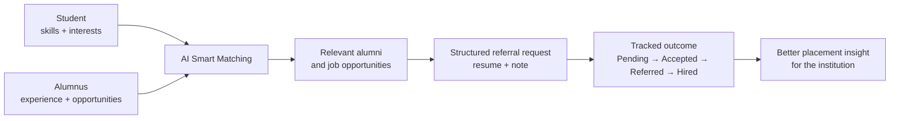
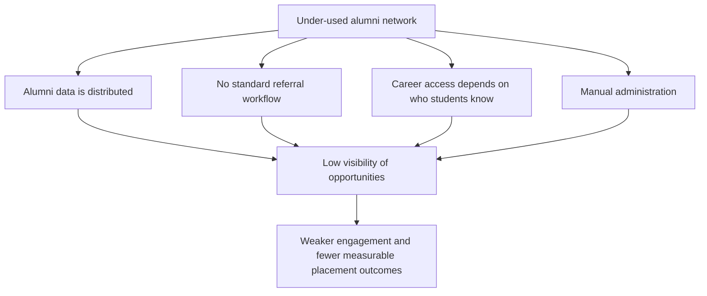
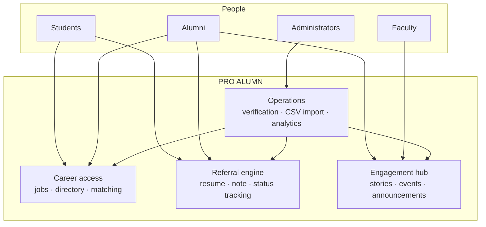
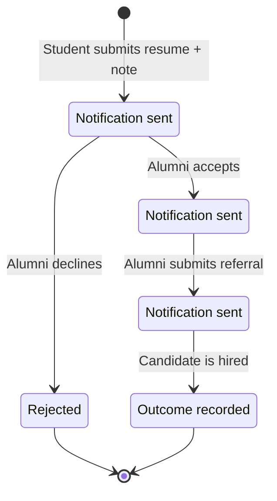
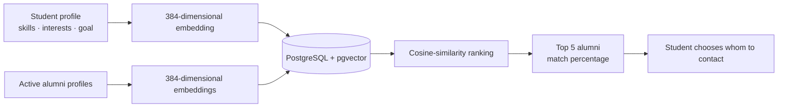
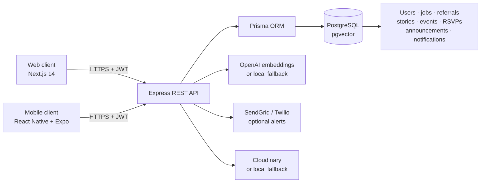
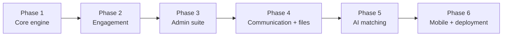
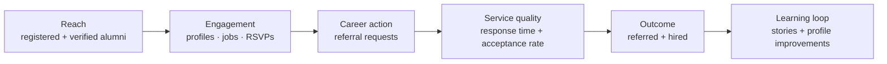

# PRO ALUMN — Idea Documentation

> **Centralized alumni engagement and career referral platform for colleges**  
> **Format:** Web + mobile application, powered by a shared API and an AI-assisted alumni matching engine.

---

## 1. Executive Summary

PRO ALUMN is a single digital platform that helps a college turn its alumni network into a visible, accessible and measurable career-support system. Students can find relevant alumni and job opportunities, request referrals with their resume and a personal note, and track the outcome of every request. Alumni can post jobs, respond to requests, share success stories and participate in events. Faculty and administrators can verify alumni, import alumni records in bulk, publish announcements, review stories and monitor outcomes from one dashboard.

The solution replaces disconnected WhatsApp groups, emails, spreadsheets and informal personal networks with one trustworthy workflow. Its key differentiator is **AI Smart Matching**: it recommends the five alumni whose profiles are most relevant to a student's skills, interests and career goals. This gives students who do not already have personal connections a fairer starting point.

### The idea in one visual

---

## 2. Problem Statement

Most colleges have alumni who are willing to help, but students cannot easily discover the right people or opportunities. Information is fragmented across social-media groups, WhatsApp messages, email threads, event lists and spreadsheet records. This creates five linked problems:

| Current gap | Effect on stakeholders |
|---|---|
| Alumni information is scattered or outdated | Students do not know which alumni work in a relevant company, role or location. |
| Referral requests are informal | Requests are missed, duplicated or forgotten; neither student nor college can see the outcome. |
| Career support depends on personal connections | Well-connected students get more access than equally capable students with smaller networks. |
| Administrative work is manual | Alumni verification, batch onboarding, story approval and reporting consume staff time. |
| Engagement has no shared home | Jobs, stories, events and announcements are not connected, and mobile access is limited. |

### Root-cause map

---

## 3. Proposed Solution

PRO ALUMN is a role-based platform with four connected experience areas:

1. **Career access for students** — browse jobs, search alumni by batch, department, company or location, receive personalized recommendations, submit referral requests and monitor every status change.
2. **A simple contribution channel for alumni** — post opportunities, act on referral requests, share success stories and create or attend events from web or mobile.
3. **A trusted operations layer for faculty and admins** — verify alumni profiles, import a batch through CSV, publish announcements, moderate success stories and view engagement analytics.
4. **An engagement hub for the institution** — keep jobs, referrals, stories, events, notifications and announcements in one governed system.

### Platform ecosystem

### Key product capabilities

| Capability | What it does | Why it matters |
|---|---|---|
| Job board | Alumni and admins publish openings; students search and filter opportunities. | Makes alumni-led openings visible beyond personal circles. |
| Alumni directory | Students filter alumni by batch, department, company and location. | Converts an invisible network into a searchable resource. |
| Referral engine | A student sends a resume and note; the alumnus can accept, reject, mark referred or mark hired. | Replaces informal follow-up with a transparent, accountable process. |
| Status tracking and notifications | The request lifecycle is visible and each meaningful change creates an in-app notification; email and WhatsApp alerts are available when configured. | Students know what is happening and alumni receive timely prompts. |
| AI Smart Matching | Shows a student the most relevant active alumni profiles, ranked by profile similarity. | Reduces the effort of finding the right person and improves access equity. |
| Stories, events and announcements | A moderated Spotlight Wall, event RSVP with capacity control, and faculty/admin announcements. | Keeps the alumni community active between hiring cycles. |
| Admin command center | Verification, CSV import, story review and outcome analytics. | Reduces repetitive administrative work and creates useful institutional data. |

---

## 4. How the Solution Addresses the Problem

| Problem | PRO ALUMN response | Expected operational change |
|---|---|---|
| Alumni network is under-used | Directory search, job board, events and a personalized “Top 5 Alumni for You” list make opportunities discoverable. | More students can identify relevant alumni without relying on introductions. |
| Referral requests are scattered and untracked | A dedicated request record carries the job, resume, note, current state and timestamped updates. | Requests have an owner, a visible history and a measurable outcome. |
| Students lack personalized guidance | Matching compares the student profile with active alumni profiles using cosine similarity. | The first people shown are relevant to the student's profile rather than a generic list. |
| Admin workflows are manual | Role-based verification, CSV onboarding, moderation and dashboard statistics centralize routine tasks. | Staff can manage a larger alumni base with clearer controls. |
| Mobile access is missing | The Expo/React Native client uses the same secured API as the web application. | Students and alumni can use the platform from Android or iOS as well as a browser. |

### Referral journey

**Controls in the journey:** only authenticated users can access protected records; role checks limit sensitive actions such as posting jobs, publishing announcements, verifying alumni and running bulk imports. The referral path provides both a useful student experience and a reliable source of placement data.

---

## 5. Innovation and Uniqueness

### 5.1 Equal-access, AI-assisted discovery

The platform does not use AI to make hiring decisions. Instead, it helps a student discover relevant people. A profile is formed from department, company, role, location, bio, skills and interests; the matching engine returns the most similar **active alumni** profiles. The alumnus remains in control of whether to accept a referral request, and the final hiring decision remains with the employer.

### 5.2 Hybrid matching that remains usable without an API key

The matching service uses OpenAI `text-embedding-3-small` with its dimensions set to 384 when an API key is available. If the key is absent or the request fails, it uses a deterministic local, 384-dimensional hashing embedding. This means a college can demonstrate, test and self-host the core matching pipeline without a mandatory external AI cost.

### 5.3 Graceful-degradation design

Optional services do not block core use:

| Optional integration | Production capability | Fallback during development or outage |
|---|---|---|
| OpenAI | Semantic profile embeddings | Deterministic local embeddings |
| SendGrid | Transactional email alerts | Console-safe placeholder behavior |
| Twilio WhatsApp | WhatsApp alerts | Console-safe placeholder behavior |
| Cloudinary | Durable resume storage | Local file storage |

This is distinctive because the platform is viable for a proof of concept and early college rollout before every paid integration is provisioned. For production, the college should configure durable object storage and managed communication credentials.

### 5.4 One business core, multiple user surfaces

The Next.js web app and Expo mobile app use the same Express REST API, authorization rules and database. This avoids duplicating business rules across platforms, keeps the referral workflow consistent and allows future clients to be added without redesigning the backend.

---

## 6. Technical Approach

### 6.1 Architecture

### 6.2 Technologies used

| Layer | Technology | Purpose |
|---|---|---|
| Web interface | Next.js 14, React 18, Tailwind CSS, Lucide, axios | Responsive browser application and user interface. |
| Mobile interface | React Native, Expo SDK 52, AsyncStorage, Expo Vector Icons | Android/iOS companion application with persisted login token. |
| Backend | Node.js, Express, Prisma ORM | REST API, business logic, input handling and database access. |
| Authentication | JWT and bcrypt | Signed access tokens and secure password hashing. |
| Database | PostgreSQL with pgvector | Transactional application data plus vector similarity search. |
| Matching | OpenAI `text-embedding-3-small` + deterministic local fallback | Profile representation and personalized alumni ranking. |
| Notifications | In-app notifications, SendGrid, Twilio WhatsApp | Status visibility and optional multichannel alerts. |
| Files and imports | multer, Cloudinary, csv-parse | Resume upload and controlled alumni batch onboarding. |
| Deployment path | Supabase/Neon, Railway/Render, Vercel, Expo EAS Build | Managed database, API, web hosting and mobile distribution. |

### 6.3 Security and data-handling approach

- **Authentication and authorization:** JWT-protected API routes, bcrypt password hashes, and role checks for student, alumni, faculty and administrator actions.
- **Least-privilege workflows:** only authorized roles can post jobs, create announcements, verify alumni, approve stories or import data.
- **Controlled uploads:** resumes are restricted to supported document types and a 5 MB maximum in the current implementation.
- **Data quality:** admin verification and a controlled CSV import path help prevent untrusted or inaccurate alumni records.
- **Production safeguards to complete before rollout:** enforce HTTPS; keep API keys in environment variables; run backups; set retention and deletion rules for resumes; log privileged actions; obtain consent for profile data and notifications; and test access-control, upload and CSV-input defenses against the applicable OWASP guidance.

### 6.4 AI matching method

1. The system creates a normalized text profile from structured profile fields and biography.
2. It generates a 384-dimensional vector through OpenAI embeddings when configured; otherwise it creates a deterministic local vector.
3. The vector is stored in the `User.embedding` column in PostgreSQL.
4. pgvector's HNSW cosine index retrieves nearby active alumni vectors efficiently.
5. The API converts cosine similarity into a readable match percentage and returns the top five results by default.
6. An administrator can re-sync all embeddings; a signed-in user can refresh their own embedding after profile edits.

**Important limitation:** a similarity percentage is a relevance signal, not a measure of employability or suitability. The UI and policy should present it as a recommendation aid and offer users a way to edit their profile or report an irrelevant result.

---

## 7. Implementation Methodology and Working Prototype

### 7.1 Incremental delivery plan

| Phase | Deliverables | Completion evidence available in the repository |
|---|---|---|
| 1. Core engine | Accounts, roles, JWT authentication, profiles | `docs/PHASE1-CHANGES.md` |
| 2. Engagement | Jobs, referrals, stories, events, RSVP, announcements and in-app notifications | `docs/PHASE2-CHANGES.md` |
| 3. Admin suite | Analytics, alumni verification, story review and CSV import | `docs/PHASE3-CHANGES.md` |
| 4. Communication and files | Email/WhatsApp integration points and resume upload | `docs/PHASE4-CHANGES.md` |
| 5. AI matching | Profile embeddings, pgvector search and matching endpoints | `docs/PHASE5-CHANGES.md` |
| 6. Mobile and deployment | Expo mobile client and deployment guidance | `docs/PHASE6-CHANGES.md`, `docs/DEPLOYMENT.md` |

### 7.2 Prototype verification approach

The working prototype is verified incrementally rather than waiting until the end:

- API JavaScript syntax checks using `node --check`.
- Web production compilation using `next build`.
- Mobile bundle generation using `npx expo export --platform android`.
- Authentication smoke tests that confirm protected endpoints return `401` without a valid token.
- Seeded accounts for administrator, alumni and student demonstration flows.
- A user-facing visual test guide in `docs/PRO ALUMN-Conclusion-TestGuide.pdf`.

### 7.3 Suggested demonstration flow

1. Log in as a **student**, search jobs and review the recommended alumni list.
2. Open a relevant opportunity, upload a resume, add a concise request note and submit a referral request.
3. Log in as an **alumnus**, review the request and change its state to accepted, referred or rejected.
4. Return to the **student** view to show the visible status and notification.
5. Log in as an **administrator**, verify an alumnus, review a story and show referral-status analytics.
6. Open the **mobile app** to show the same underlying data and workflow on a phone.

---

## 8. Feasibility and Viability

### 8.1 Feasibility assessment

| Dimension | Assessment | Rationale |
|---|---|---|
| Technical | **High for a pilot** | The system uses established web, mobile, database and API technologies. The prototype already contains the core workflows, seeded data and phased verification evidence. |
| Economic | **High for initial rollout** | A college can begin with managed/free-tier services and add paid communication, storage and AI capacity only when required. Local fallbacks reduce early dependency cost. |
| Operational | **Moderate to high** | Administrators need an owner for verification, CSV hygiene, content moderation and support, but the dashboard automates much of the repetitive work. |
| Adoption | **Moderate** | Value rises with profile completeness and alumni participation. A structured launch campaign and simple first-use experience are important. |
| Scalability | **Good for staged growth** | A shared API and PostgreSQL foundation simplify early operations; pgvector's HNSW index supports efficient similarity retrieval. Capacity, observability and backup practices should be strengthened as usage grows. |

### 8.2 Initial rollout assumptions

- The institution has an approved alumni roster or can collect one with consent.
- A staff owner is responsible for verification, moderation and responding to support issues.
- Alumni receive a clear invitation that explains the benefit, time commitment and privacy policy.
- Production deployment uses managed database backups, HTTPS, durable file storage and environment-managed secrets.
- Success is measured against a defined baseline, such as active alumni, completed profiles, requests answered and referral outcomes.

### 8.3 Challenges, risks and mitigation

| Challenge or risk | Impact if unmanaged | Mitigation strategy |
|---|---|---|
| Incomplete or outdated alumni profiles | Weak directory results and poor recommendations | Verify accounts, prompt profile completion, schedule profile refreshes and allow users to edit their details. |
| Low alumni response rate | Students lose trust in the referral process | Use focused notifications, clear request summaries, response-time reminders and recognition through stories or impact reports. |
| AI recommendations are not relevant | Users may overlook better contacts | Treat AI as an assistive ranking, keep filters and directory search available, refresh profiles after edits and collect relevance feedback. |
| Missing external API keys or an outage | Communication or AI features may be reduced | Use the implemented local/placeholder fallbacks; monitor production integrations and document degraded behavior. |
| Local uploads disappear after redeployment | Resume data could be lost | Require Cloudinary or another managed object store in production and define backup/retention policies. |
| Sensitive personal data and resumes | Privacy, reputational and compliance risk | Collect only necessary data, obtain consent, define role-based access, audit privileged actions and set deletion/retention rules. |
| CSV errors or unverified accounts | Poor data quality or unauthorized access | Validate CSV columns, use temporary passwords, require alumni verification and provide an error report for invalid rows. |
| Mobile app cannot reach the API | Demonstration or production failure | Configure environment-specific API URLs for emulator, LAN and HTTPS production use; test Android and iOS release builds. |
| Unbounded usage growth | Slow queries or rising service cost | Monitor database, storage and API usage; add rate limiting, caching, queue-based notifications and capacity planning before scale-out. |

---

## 9. Impact and Benefits

### 9.1 Impact on target audiences

| Audience | Direct impact | Outcome to measure |
|---|---|---|
| Students | A clearer path from opportunity discovery to referral outcome, including mobile access. | Profiles completed, relevant matches viewed, requests submitted, response time, referrals and hires. |
| Alumni | A low-friction way to give back through jobs, referrals, mentoring stories and events. | Active alumni, jobs posted, requests answered, events created and stories submitted. |
| Faculty and administrators | A single operating view for announcements, verification, moderation and analytics. | Time spent on administration, verified accounts, CSV onboarding accuracy and dashboard usage. |
| Institution | Better visibility into alumni engagement and career support. | Referral funnel, hiring outcomes, event participation and alumni retention. |

### 9.2 Social benefits

- Makes career guidance more accessible to students who lack personal networks.
- Strengthens the alumni–student relationship through practical, visible contribution.
- Creates a positive feedback loop: successful referrals can become stories that encourage more alumni engagement.
- Gives faculty and placement teams a coordinated way to support students.

### 9.3 Economic benefits

- Can improve access to referral-based opportunities and reduce the search effort spent on informal follow-ups.
- Uses a self-hostable architecture with optional integrations, which supports a cost-conscious pilot.
- Gives the institution outcome data to focus alumni-relations and placement activities where they produce results.

### 9.4 Environmental benefits

- Keeps resumes, announcements, records and registrations digital.
- Reduces reliance on paper forms and manual spreadsheet circulation.
- Enables remote career support and event coordination without requiring every interaction to be in person.

### 9.5 Recommended KPI dashboard

Track these KPIs monthly and compare them with a baseline established before the pilot:

1. Verified alumni and active student counts.
2. Profile-completion rate and number of updated profiles.
3. Jobs posted, applications/referral requests and event RSVPs.
4. Median referral response time and percentage of requests answered.
5. Referral funnel: pending, accepted, rejected, referred and hired.
6. Match-list engagement and user-reported recommendation relevance.
7. Administrative turnaround time for verification, imports and story moderation.

---

## 10. Research and References

### 10.1 Project evidence used for this document

This documentation is grounded in the current project artefacts, especially:

- [Presentation source](PRESENTATION.md) — the six-slide idea narrative, feature list and implementation phases.
- [Project README](../README.md) — delivered features, stack, setup and API surface.
- [Database schema](../prisma/schema.prisma) — roles, application records and the 384-dimensional vector field.
- [Smart-matching service](../apps/api/src/services/embeddings.js) and [matching routes](../apps/api/src/routes/matching.js) — implementation of the AI-assisted recommendation flow.
- [Deployment guide](DEPLOYMENT.md) and phase change logs — deployment and verification evidence.

### 10.2 Research basis

| Topic | Reference | Relevance to PRO ALUMN |
|---|---|---|
| Referral-based hiring | [NBER Working Paper 25920](https://www.nber.org/papers/w25920) | Provides research context for employee referral programs, including candidate quality, turnover and recruiting-cost considerations. These findings motivate measuring outcomes locally rather than promising a guaranteed hiring result. |
| Referral information and productivity | [NBER Working Paper 21357](https://www.nber.org/papers/w21357) | Explores how referrals can convey useful information in hiring, supporting a structured referral workflow. |
| Vector similarity search | [pgvector documentation](https://github.com/pgvector/pgvector) | Documents vector columns, cosine distance and HNSW indexing used by the matching layer. |
| Embeddings | [OpenAI embeddings guide](https://platform.openai.com/docs/guides/embeddings) | Technical reference for the optional semantic embedding provider. |
| Secure tokens | [RFC 7519 — JSON Web Token](https://www.rfc-editor.org/rfc/rfc7519) | Standard reference for the JWT-based authentication design. |
| Application security | [OWASP Top 10](https://owasp.org/www-project-top-ten/) | Baseline for secure authentication, authorization, uploads and input handling. |

### 10.3 Technology documentation

| Technology | Official documentation |
|---|---|
| Next.js | [nextjs.org/docs](https://nextjs.org/docs) |
| React Native / Expo / EAS Build | [docs.expo.dev](https://docs.expo.dev/) and [EAS Build](https://docs.expo.dev/build/introduction/) |
| Node.js | [nodejs.org/docs](https://nodejs.org/en/docs) |
| Express | [expressjs.com](https://expressjs.com/) |
| Prisma ORM | [prisma.io/docs](https://www.prisma.io/docs) |
| PostgreSQL | [postgresql.org/docs](https://www.postgresql.org/docs/) |
| SendGrid | [docs.sendgrid.com](https://docs.sendgrid.com/) |
| Twilio WhatsApp | [twilio.com/docs/whatsapp](https://www.twilio.com/docs/whatsapp) |
| Cloudinary | [cloudinary.com/documentation](https://cloudinary.com/documentation) |
| Supabase | [supabase.com/docs](https://supabase.com/docs) |
| Vercel | [vercel.com/docs](https://vercel.com/docs) |

---

## 11. Conclusion

PRO ALUMN is not only an alumni directory. It is a complete engagement and career-support workflow: it makes the network visible, helps students identify relevant alumni, turns informal requests into trackable records, and gives the institution the information needed to improve outcomes. Its hybrid matching design, shared web/mobile backend and graceful handling of optional services make it practical for a college pilot while leaving a clear path to a secure production rollout.

The recommended next step is a controlled pilot with one department or graduating batch. Establish the baseline KPIs, onboard and verify alumni, gather feedback on matching relevance and referral response times, then expand based on measured results.
